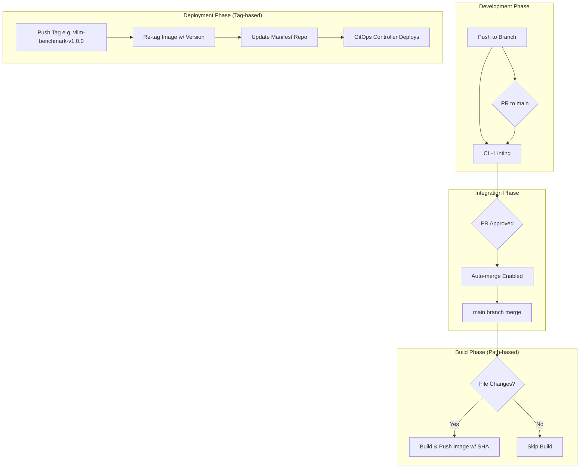

# 🚀 CI/CD 가이드

이 문서는 `vllm-eval-public` 프로젝트의 CI/CD 파이프라인에 대한 가이드와 그 전략을 설명합니다. 워크플로는 크게 **CI (지속적 통합)**, **빌드**, **배포**, **유틸리티**의 네 가지 범주로 나뉩니다.

## 📋 목차

- [워크플로우 개요 및 핵심 전략](#워크플로우-개요-및-핵심-전략)
- [각 워크플로우 상세](#각-워크플로우-상세)
- [개발 워크플로우](#개발-워크플로우)
- [배포 프로세스](#배포-프로세스)
- [문제 해결](#문제-해결)

## 🔄 워크플로우 개요 및 핵심 전략

### 핵심 전략
우리 프로젝트의 CI/CD 전략은 **효율성**, **안정성**, **자동화**라는 세 가지 핵심 원칙을 기반으로 합니다.

- **효율성 (파일 경로 기반 빌드)**: `dorny/paths-filter` 액션을 사용하여 각 컴포넌트와 관련된 파일(`Dockerfile`, 소스 코드, 설정 파일 등)이 변경되었을 때만 빌드 작업을 트리거합니다. 이를 통해 관련 없는 변경으로 인한 불필요한 이미지 빌드를 방지합니다.

- **안정성 (GitOps 기반 배포)**: 배포는 **수동 태그 기반**으로 트리거되며, **GitOps** 원칙을 따릅니다. 이는 `main` 브랜치의 모든 변경이 자동으로 프로덕션에 배포되지 않음을 의미하며, 명시적인 버전 릴리스를 통해 안정성을 확보합니다.

- **자동화 (리뷰 및 병합 자동화)**: 코드 리뷰 승인 시 PR 병합을 자동화하여 개발 생산성을 높이고 일관된 병합 프로세스를 유지합니다.

### 전체 워크플로 흐름도



### 워크플로 요약
| 워크플로우 | 파일명 | 트리거 | 목적 |
|------------|--------|--------|------|
| **CI** | `ci.yml` | 브랜치 Push/PR | 코드 스타일 및 포맷 검증 (Linter) |
| **Component Build** | `*-build.yml` | main 브랜치 머지 (파일 변경 시) | Docker 이미지 빌드 및 GHCR Push (SHA 태그) |
| **Component Deploy** | `*-deploy.yml` | 컴포넌트별 Tag 생성 | GitOps 매니페스트 업데이트 (이미지 버전 태그) |
| **Auto-merge** | `auto-merge.yml` | PR 승인 | GitHub Auto-merge 기능 활성화 |

## 📝 각 워크플로우 상세

### 1. CI (지속적 통합) - `ci.yml`

- **목적**: 코드베이스의 품질과 일관성을 유지합니다. 코드 스타일 가이드를 준수하고 잠재적인 오류를 사전에 발견하는 것을 목표로 합니다.
- **트리거**:
    - `main` 또는 `hotfix/**` 브랜치를 제외한 모든 브랜치로 `push`될 때
    - `main` 브랜치에 대한 `pull_request`가 생성/수정될 때
- **주요 작업 (병렬 처리)**:
    - **🐍 Python Lint**: `black`, `flake8`
    - **📜 Shell Script Lint**: `shellcheck`
    - **🐳 Dockerfile Lint**: `hadolint`
    - **📝 Markdown Lint**: `markdownlint`
    - **📄 YAML Lint**: `yamllint`
- **특징**: 모든 린트 작업은 `continue-on-error: true`로 설정되어, 일부 린트가 실패하더라도 전체 워크플로가 중단되지 않고 모든 검사를 완료하여 개발자에게 리포트합니다.

### 2. 컴포넌트 빌드 (Build) - `*-build.yml`
각 평가 컴포넌트(`vllm-benchmark`, `standard-evalchemy`, `evalchemy`)는 독립적인 워크플로를 통해 빌드됩니다.

- **파일 목록**: `evalchemy-build.yml`, `standard-evalchemy-build.yml`, `vllm-benchmark-build.yml`
- **트리거**:
    - `main` 브랜치로 `push`
    - `main` 브랜치에 대한 `pull_request`
- **주요 작업**:
    1.  **파일 변경 감지**: `dorny/paths-filter`를 사용해 컴포넌트 관련 파일 변경 시에만 워크플로를 실행합니다.
    2.  **이미지 빌드 및 푸시**:
        - **Pull Request**: 이미지를 빌드만 수행하여 병합 전 코드의 빌드 가능성을 검증합니다. (푸시하지 않음)
        - **Push to `main`**: 이미지를 빌드하고, 해당 커밋의 `SHA`를 태그로 사용하여 `ghcr.io` 컨테이너 레지스트리에 푸시합니다. 이 이미지는 '릴리스 후보' 역할을 합니다.

### 3. GitOps 기반 배포 (Deploy) - `*-deploy.yml`
배포는 명시적인 버전 릴리스를 통해 안정성을 확보합니다.

- **파일 목록**: `evalchemy-deploy.yml`, `standard-evalchemy-deploy.yml`, `vllm-benchmark-deploy.yml`
- **트리거**:
    - 컴포넌트별 버전 태그 `push` (예: `vllm-benchmark-v*.*.*`)
- **주요 작업 (GitOps)**:
    1.  **이미지 리태깅(Re-tagging)**: 새 이미지를 빌드하지 않고, `main` 브랜치에서 이미 생성된 `SHA` 태그 이미지를 찾아, 배포를 트리거한 버전 태그(예: `v1.2.3`)를 추가로 부여합니다. (`crane` 도구 사용)
    2.  **매니페스트 업데이트**:
        - 별도의 매니페스트 저장소(`ThakiCloud/vllm-manifests-public`)를 체크아웃합니다.
        - 해당 컴포넌트의 쿠버네티스 매니페스트 파일 내의 이미지 태그를 새로 부여된 버전 태그로 업데이트합니다.
        - 변경 사항을 매니페스트 저장소에 커밋하고 푸시합니다.
    3.  **클러스터 배포**: ArgoCD나 Flux와 같은 GitOps 도구가 매니페스트 저장소의 변경을 감지하여 쿠버네티스 클러스터에 자동으로 애플리케이션을 업데이트합니다.

### 4. 유틸리티 (Utility) - `auto-merge.yml`
- **목적**: 코드 리뷰 및 병합 프로세스를 자동화하여 개발 생산성을 높입니다.
- **트리거**: Pull Request에 대해 `approved` 리뷰가 제출될 때 실행됩니다.
- **주요 작업**:
    - 해당 PR에 대해 `squash` 방식의 자동 병합(auto-merge)을 활성화합니다.
    - `auto-merge` 라벨을 PR에 추가하여 시각적으로 상태를 표시합니다.
    - 이를 통해 모든 필수 검사가 통과되면 PR이 자동으로 병합되도록 설정합니다.

## 👩‍💻 개발 워크플로우

### 🆕 새 기능 개발

```bash
# 1. 새 브랜치 생성
git checkout -b feature/new-logic

# 2. 작업 수행 (예: vllm-benchmark 관련 로직 수정)
# - docker/vllm-benchmark.Dockerfile
# - eval/vllm-benchmark/run.py

# 3. 커밋 및 푸시
git add .
git commit -m "feat: Update vllm-benchmark logic"
git push origin feature/new-logic
```

**→ 자동으로 `CI` 워크플로우 실행 (Linter 검사)**

### 📋 Pull Request 생성

- GitHub에서 `main` 브랜치로 PR을 생성합니다.
- PR 생성 시, 변경된 파일 경로(`eval/vllm-benchmark/**`)에 따라 `vllm-benchmark-build` 워크플로우가 자동으로 실행되어 Docker 빌드 유효성을 검증합니다.

### ✅ 승인 및 머지

1. **리뷰어 승인** → `Auto-merge` 워크플로우가 실행되어 자동 머지 활성화
2. **`main` 브랜치 머지** → `vllm-benchmark-build` 워크플로우가 다시 실행되어, 이미지를 빌드하고 Commit SHA를 태그로 하여 `ghcr.io`에 푸시합니다.

## 🚀 배포 프로세스

### 📦 컴포넌트 배포 (vllm-benchmark 예시)

```bash
# 1. main 브랜치 최신화 및 배포할 커밋 확인
git checkout main
git pull origin main

# 2. 배포할 커밋을 가리키는 태그 생성 및 푸시
# 형식: {컴포넌트명}-v{Major}.{Minor}.{Patch}
git tag vllm-benchmark-v1.2.3
git push origin vllm-benchmark-v1.2.3
```

**→ 자동으로 `vllm-benchmark-deploy` 워크플로우가 실행됩니다.**
**→ 배포 결과는 `vllm-manifests-public` 리포지토리에서 확인할 수 있습니다.**

## 🛠️ 문제 해결

### 🚨 CI/Build 실패 대응

- **Linter 실패**: `ci.yml` 워크플로우 로그에서 실패한 Linter의 상세 내용을 확인하고 코드를 수정합니다.
- **Build 실패**: `*-build.yml` 워크플로우 로그에서 Docker 빌드 실패 원인을 확인합니다. 로컬에서 동일한 Dockerfile로 빌드를 테스트해볼 수 있습니다.

### 🚀 배포 실패 대응

- **"Image not found" 오류**:
  1. `main` 브랜치에 해당 커밋이 정상적으로 머지되었는지 확인합니다.
  2. `*-build.yml` 워크플로우가 성공적으로 실행되어 `ghcr.io`에 SHA 태그로 이미지를 푸시했는지 확인합니다.
- **Manifest 업데이트 실패**:
  1. `*-deploy.yml` 워크플로우의 권한(`secrets.MANIFESTS_SECRET`)이 올바른지 확인합니다.
  2. `ThakiCloud/vllm-manifests-public` 리포지토리의 파일 경로가 올바른지 확인합니다.

---

**📞 문의사항이 있으시면 GitHub Issues를 생성해 주세요!** 