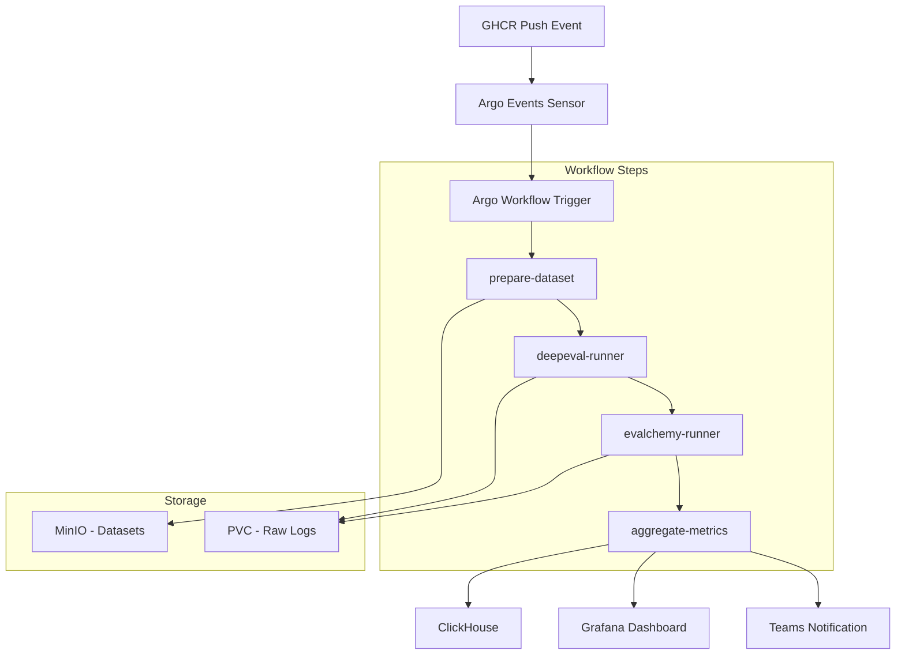

# VLLM 모델 성능 자동 평가 시스템

> 쿠버네티스 클러스터에 배포된 **VLLM** 서빙 모델을 **Deepeval** 및 **Evalchemy** ([mlfoundations/Evalchemy](https://github.com/mlfoundations/Evalchemy))로 지속적·자동으로 평가하여 모델 품질 지표를 확보하고 품질 퇴화를 즉시 탐지하는 CI/CD 파이프라인

[](https://github.com/your-org/vllm-eval/actions/workflows/lint-test.yml)
[](https://github.com/your-org/vllm-eval/actions/workflows/image-build.yml)

## 🎯 목적

- **모델 릴리스마다** 객관적 품질 지표 확보
- **품질 퇴화(regression)** 즉시 탐지
- **Microsoft Teams 채널**에 실시간 리포팅/알림 제공
- **표준 벤치마크**(ARC, HellaSwag, MMLU 등) 및 **커스텀 메트릭** 자동 평가

## 🏗️ 시스템 아키텍처



## 📁 주요 폴더·파일 설명

### `.github/workflows/`
- **`ci.yml`** – ruff (정적 분석) + pytest + 스키마 검증 수행
- **`evalchemy-build.yml`, `standard-evalchemy-build.yml`, `vllm-benchmark-build.yml`** – 각 평가 환경에 맞는 Docker 이미지를 빌드하여 GHCR에 푸시합니다.
- **`evalchemy-deploy.yml`, `standard-evalchemy-deploy.yml`, `vllm-benchmark-deploy.yml`** – 빌드된 이미지를 쿠버네티스 환경에 배포하는 워크플로우입니다.

### `charts/`
Helm 차트를 사용하여 쿠버네티스 애플리케이션(ClickHouse, Grafana, Argo Workflows 등)을 패키징하고 배포를 관리합니다.

### `k8s/`
- **`evalchemy-job.yaml`, `standard-evalchemy-job.yaml`, `vllm-benchmark-job.yaml`** – Argo Workflows에서 사용할 각 평가 단계를 정의하는 쿠버네티스 Job/Workflow 템플릿입니다.

### `eval/`
- **`deepeval_tests/`** – PyTest 스타일 스위트, DeepEval 커스텀 Metric 위치
- **`evalchemy/`** – LM-evaluation-harness 래퍼; ARC, MMLU, Ko-MMLU 등 구성

### `datasets/`
- SHA-256 매니페스트 YAML만 보관—원본 데이터는 MinIO
- `dedup_datasets.py`가 MinHash-LSH로 중복 제거를 수행

### `scripts/`
- **`aggregate_metrics.py`** – ClickHouse에 결과 기록
- 로컬 실행·디버그용 유틸리티 스크립트 포함

### `docker/`
- **`deepeval.Dockerfile`** – Deepeval 기반 PyTest 평가 러너
- **`evalchemy.Dockerfile`** – Evalchemy 기반 표준 벤치마크 러너
- **`standard-evalchemy.Dockerfile`** – 표준화된 Evalchemy 하네스 이미지
- **`nvidia-eval.Dockerfile`** – AIME/LiveCodeBench 등 NVIDIA 평가 러너
- **`vllm-benchmark.Dockerfile`** – VLLM 공식 benchmark_serving.py 기반 성능 측정 컨테이너

### `Makefile`
- `make kind-deploy`, `make helm-install`, `make run-tests` 등 공통 타깃

## 🐳 Docker 이미지: 빌드 & 실행 예시

아래 예시는 각 이미지의 대표적인 빌드/실행 방법입니다. 플랫폼별 상세 명령은 `docker/README.md`를 참고하세요.

### Evalchemy

```bash
# Build (linux/amd64)
docker buildx build --platform linux/amd64 \
  -f docker/evalchemy.Dockerfile \
  -t ghcr.io/thakicloud/evalchemy-linux:latest .

# Run
docker run --rm \
  -v $(pwd)/results:/app/results \
  -v $(pwd)/parsed:/app/parsed \
  -e MODEL_ENDPOINT="http://host.docker.internal:8000/v1/completions" \
  -e MODEL_NAME="qwen3-8b" \
  -e LOG_LEVEL="DEBUG" \
  ghcr.io/thakicloud/evalchemy-linux:latest
```

### Standard Evalchemy

```bash
# Build (linux/amd64)
docker buildx build --platform linux/amd64 \
  -f docker/standard-evalchemy.Dockerfile \
  -t ghcr.io/thakicloud/standard-evalchemy-linux:latest .

# Run
docker run --rm \
  -v $(pwd)/results:/app/results \
  -v $(pwd)/parsed:/app/parsed \
  -e MODEL_ENDPOINT="http://host.docker.internal:8000/v1/completions" \
  -e MODEL_NAME="qwen3-8b" \
  ghcr.io/thakicloud/standard-evalchemy-linux:latest
```

### NVIDIA Eval (AIME / LiveCodeBench)

```bash
# Build (linux/amd64)
docker buildx build --platform linux/amd64 \
  -f docker/nvidia-eval.Dockerfile \
  -t ghcr.io/thakicloud/nvidia-eval-linux:latest .

# Run (AIME)
docker run --rm \
  -v $(pwd)/results:/app/results \
  -v $(pwd)/parsed:/app/parsed \
  -e MODEL_ENDPOINT="http://host.docker.internal:8000/v1" \
  -e MODEL_NAME="qwen3-8b" \
  -e EVAL_TYPE="aime" \
  -e MAX_TOKENS="32768" \
  ghcr.io/thakicloud/nvidia-eval-linux:latest

# Run (AIME + LiveCodeBench)
docker run --rm \
  -v $(pwd)/results:/app/results \
  -v $(pwd)/parsed:/app/parsed \
  -e MODEL_ENDPOINT="http://host.docker.internal:8000/v1" \
  -e MODEL_NAME="qwen3-8b" \
  -e EVAL_TYPE="both" \
  ghcr.io/thakicloud/nvidia-eval-linux:latest
```

### VLLM Benchmark

```bash
# Build (linux/amd64)
docker buildx build --platform linux/amd64 \
  -f docker/vllm-benchmark.Dockerfile \
  -t ghcr.io/thakicloud/vllm-benchmark-linux:latest .

# Run
docker run --rm \
  --network host \
  -v $(pwd)/results:/app/results \
  -v $(pwd)/parsed:/app/parsed \
  -e MODEL_ENDPOINT="http://localhost:8080" \
  -e MODEL_NAME="Qwen/Qwen2-0.5B" \
  -e TOKENIZER="gpt2" \
  ghcr.io/thakicloud/vllm-benchmark-linux:latest
```

## ☸️ Kubernetes에서 실행 (k8s/)

다음 Job 매니페스트는 `k8s/` 폴더에 포함되어 있으며, 기본 설정으로 바로 실행할 수 있습니다. 이미지 풀을 위해 GHCR 시크릿이 필요합니다.

### 사전 준비: GHCR 이미지 Pull Secret

```bash
kubectl create secret docker-registry ghcr-secret \
  --docker-server=ghcr.io \
  --docker-username="<your_github_username>" \
  --docker-password="<your_github_pat>"
```

### 공통 실행/모니터링

```bash
# 적용
kubectl apply -f k8s/evalchemy-job.yaml
kubectl apply -f k8s/standard-evalchemy-job.yaml
kubectl apply -f k8s/vllm-benchmark-job.yaml
kubectl apply -f k8s/nvidia-eval-job.yaml

# 상태 확인
kubectl get jobs

# 로그 확인
kubectl logs -f job/evalchemy
kubectl logs -f job/standard-evalchemy
kubectl logs -f job/vllm-benchmark
kubectl logs -f job/nvidia-eval
```

### 환경 변수 (매니페스트 기준)

- Evalchemy (`k8s/evalchemy-job.yaml`)
  - `MODEL_ENDPOINT="http://vllm.vllm:8000/v1/completions"`
  - `BACKEND_API="http://10.7.60.71:10301"`
  - `MAX_TOKENS="1400"`
  - `EVAL_CONFIG_PATH="/app/configs/eval_config.json"`

- Standard Evalchemy (`k8s/standard-evalchemy-job.yaml`)
  - `MODEL_ENDPOINT="http://vllm.vllm:8000/v1/completions"`
  - `BACKEND_API="http://10.7.60.71:10301"`
  - `MAX_TOKENS="140"`
  - `HF_TOKEN=""` (필요 시 설정)
  - `EVAL_CONFIG_PATH="/app/configs/eval_config.json"`

- VLLM Benchmark (`k8s/vllm-benchmark-job.yaml`)
  - `MODEL_ENDPOINT="http://vllm.vllm:8000"` (Base URL)
  - `RANDOM_INPUT_LEN="512"`
  - `MAX_CONCURRENCY="1"`
  - `BACKEND_API="http://10.7.60.71:10301"`
  - `CONFIG_PATH="/app/configs/eval_config.json"`

- NVIDIA Eval (`k8s/nvidia-eval-job.yaml`)
  - `MODEL_ENDPOINT="http://vllm.vllm:8000/v1"`
  - `BACKEND_API="http://10.7.60.71:10301"`
  - `MAX_TOKENS="1400"`
  - `EVAL_TYPE="aime"` (가능: `aime` | `lcb` | `both`)
  - `OUTPUT_DIR="output"`

### 참고 사항

- Job들은 기본적으로 결과 디렉터리(`/app/results`, `/app/parsed`)를 컨테이너 내부에 생성합니다. 장기 보존이 필요하면 PVC 마운트를 추가하세요.
- `nodeAffinity`가 CPU 노드 선호/고정으로 설정되어 있습니다. GPU가 필요한 워크로드의 경우 GPU 노드로 스케줄링 정책을 조정하세요.
- `MODEL_ENDPOINT`는 각 프레임워크 기대 형식이 다릅니다. VLLM Benchmark는 Base URL, Evalchemy/Standard Evalchemy는 `/v1/completions`, NVIDIA Eval은 `/v1` Base를 사용합니다.

## 🚀 빠른 시작

### 1. Kind 클러스터 + Argo + ClickHouse 부트스트랩
```bash
make kind-deploy
```

### 2. 테스트 모델 이미지 빌드 & Push
```bash
export IMG_TAG=release-0.0.1
docker build -t ghcr.io/<org>/vllm:${IMG_TAG} .
docker push ghcr.io/<org>/vllm:${IMG_TAG}
```

### 3. 워크플로 모니터링
```bash
argo watch -n mlops -w
```


## ⚡ VLLM 성능 벤치마크

VLLM 서빙 성능을 측정하는 독립적인 벤치마크 시스템입니다.

### 🎯 성능 메트릭
- **TTFT (Time to First Token)**: 첫 토큰 생성 시간
- **TPOT (Time per Output Token)**: 토큰당 생성 시간  
- **ITL (Inter-token Latency)**: 토큰 간 지연시간
- **E2EL (End-to-End Latency)**: 전체 응답 시간
- **Throughput**: 초당 토큰 처리량
- **Success Rate**: 요청 성공률

### 🏃‍♂️ 빠른 실행

```bash
# 1. Docker 이미지 빌드 (예: linux/amd64)
docker buildx build --platform linux/amd64 \
  -f docker/vllm-benchmark.Dockerfile \
  -t vllm-benchmark:latest .

# 2. 단일 벤치마크 실행 (표준화된 경로/변수 사용)
docker run --rm \
  --network host \
  -v $(pwd)/results:/app/results \
  -v $(pwd)/parsed:/app/parsed \
  -e MODEL_ENDPOINT=http://your-vllm-server:8000 \
  -e MODEL_NAME=Qwen/Qwen3-8B \
  -e MAX_CONCURRENCY=4 \
  vllm-benchmark:latest

# 2-1. 샘플
docker run --rm \
  --network host \
  -v $(pwd)/results:/app/results \
  -v $(pwd)/parsed:/app/parsed \
  -e MODEL_ENDPOINT=http://your-vllm-server:8000 \
  -e MODEL_NAME=Qwen/Qwen3-8B \
  -e SERVED_MODEL_NAME=qwen3-8b \
  -e MAX_CONCURRENCY=1 \
  -e RANDOM_INPUT_LEN=1024 \
  -e RANDOM_OUTPUT_LEN=1024 \
  vllm-benchmark:latest

# 3. 다중 시나리오 벤치마크 실행
chmod +x scripts/run_vllm_performance_benchmark.sh
MODEL_ENDPOINT=http://your-vllm-server:8000 ./scripts/run_vllm_performance_benchmark.sh

# 4. 결과 분석
python3 scripts/analyze_performance_results.py results/performance
```

### 📊 벤치마크 시나리오

`configs/vllm_benchmark.json`에서 설정:

| 시나리오 | 설명 | 동시성 | 입력/출력 토큰 |
|----------|------|--------|----------------|
| `basic_performance` | 기본 성능 측정 | 1 | 1024/128 |
| `concurrency_test` | 동시 요청 처리 | 10 | 512/256 |
| `long_context` | 긴 컨텍스트 처리 | 2 | 4096/512 |
| `stress_test` | 고부하 스트레스 | 20 | 2048/1024 |

### 🎛️ 환경변수 설정

```bash
# 기본 설정 (표준화된 변수)
MODEL_ENDPOINT=http://localhost:8000   # VLLM 서버 Base URL
MODEL_NAME=Qwen/Qwen3-8B              # 모델 이름
SERVED_MODEL_NAME=qwen3-8b            # 서빙 모델명
MAX_CONCURRENCY=1                     # 최대 동시 요청
RANDOM_INPUT_LEN=1024                 # 입력 토큰 길이
RANDOM_OUTPUT_LEN=128                 # 출력 토큰 길이
TZ=Asia/Seoul                         # 시간대 설정
```
### 📈 성능 분석 결과

```
📊 VLLM 성능 벤치마크 분석 결과
============================================================

🎯 시나리오: basic_performance
----------------------------------------
✅ 성공률: 100.0% (100/100)
⏱️  총 소요시간: 45.2초
🔄 요청 처리량: 2.21 req/s
📤 토큰 처리량: 283.4 tok/s
🚀 TTFT 평균: 82.1ms
🚀 TTFT P95: 156.3ms
⚡ TPOT 평균: 28.5ms
⚡ TPOT P95: 45.2ms

🏆 종합 성능 등급: A
✨ 모든 성능 지표가 우수합니다!

```
## 🔄 브랜칭 & 릴리스 태그

| 브랜치 | 특징 |
|--------|------|
| `main` | 보호 브랜치·스테이징 클러스터 자동 배포 |
| `release/*` | PR 병합 시 `release-{semver}` 이미지 빌드·GHCR 푸시→Argo Trigger |

`docs/` 브랜치를 따로 두어 MkDocs 기반 GitHub Pages 운영 가능.

## 🔁 지속적 피드백 루프

1. **개발자**가 `release-0.3.1` 이미지를 Push → **GHCR Webhook** 발생
2. **Argo Events Sensor**가 감지 → **Argo Workflow** 실행
3. **Workflow**가 Deepeval(CPU) → Evalchemy(GPU) 순으로 수행
4. `aggregate_metrics.py`가 **ClickHouse**에 결과 저장, **Grafana**가 자동 갱신
5. **Adaptive Card**가 요약(성공/실패, 지표 변화)을 **Teams 채널**에 전송

## 📊 데이터셋·벤치마크

| 카테고리 | 예시 | 관리 방식 |
|----------|------|-----------|
| 표준 벤치마크 | ARC, HellaSwag, MMLU | Evalchemy Preset |
| 한국어 벤치마크 | Ko-MMLU, Ko-ARC | 별도 bucket `ko-benchmark` |
| 리그레션 세트 | 서비스 쿼리 스냅샷 1k | 일 1회 익명화 & SHA-256 Dedup |

**Deduplication** 전략: SHA-1/256 Hash → Exact Match 제거 → Near-Dup (LSH + Levenshtein < 0.2) 필터로 Deepeval·Evalchemy 양측 데이터셋 중복 제거.

## 🎯 성공 지표

| 항목 | 목표값 | 측정 방법 |
|------|--------|-----------|
| 릴리스‑to‑리포트 지연 | ≤ 2h | 파이프라인 완료 타임스탬프 |
| 품질 퇴화 감지율 | ≥ 95% | Known‑Bad 리그레션 세트 |
| 파이프라인 안정성 | 실패 < 1%/월 | CronJob 성공률 |

## 🔧 기술 스택

- **컨테이너 오케스트레이션**: Kubernetes
- **워크플로**: Argo Workflows, Argo Events
- **평가 프레임워크**: Deepeval, Evalchemy ([mlfoundations/Evalchemy](https://github.com/mlfoundations/Evalchemy))
- **저장소**: ClickHouse (메트릭), MinIO (데이터셋)
- **모니터링**: Grafana, Prometheus
- **알림**: Microsoft Teams Webhooks
- **패키징**: Helm Charts

## 📈 향후 확장 아이디어

| 영역 | 아이디어 |
|------|----------|
| **보안** | OPA Gatekeeper로 ServiceAccount 제약 |
| **비용** | Spot-node taint + Argo node-selector |
| **데이터** | 중복 해시를 Milvus로 이동해 빠른 조회 |

## 🔐 보안 고려사항

- **ServiceAccount** 최소 RBAC 권한
- **Secrets** External Secret Operator 연동
- 모든 **RUN_ID** 별 JSONL 로그 S3 ≥ 90일 보존

## 📚 문서

- [아키텍처 문서](docs/architecture.md)
- [벤치마크 추가 가이드](docs/how-to-add-benchmark.md)
- [기여 가이드](docs/CONTRIBUTING.md)

## 🤝 기여하기

1. Fork the repository
2. Create your feature branch (`git checkout -b feature/amazing-feature`)
3. Commit your changes (`git commit -m 'Add some amazing feature'`)
4. Push to the branch (`git push origin feature/amazing-feature`)
5. Open a Pull Request

## 📄 라이선스

이 프로젝트는 MIT 라이선스 하에 배포됩니다. 자세한 내용은 [LICENSE](LICENSE) 파일을 참조하세요.

## 📞 연락처

- **제품 오너**: [Product Owner Email]
- **ML Ops**: [MLOps Team Email]  
- **플랫폼 Ops**: [Platform Team Email]

---

> 🚀 **VLLM 모델의 품질을 지속적으로 모니터링하고 개선하세요!**