# System Overview

The VLLM Evaluation System provides a comprehensive solution for evaluating large language models through a **dual architecture approach** that supports both local development workflows and scalable production deployments.

!!! info "Architecture Highlights"
    
    - 🏗️ **Dual Architecture**: CLI-based local development + Kubernetes production
    - 🔌 **Unified Interface**: Single CLI for all evaluation frameworks
    - 🧪 **Flexible Deployment**: From laptop to enterprise scale
    - 📊 **Standardized Results**: Consistent metrics across all execution modes

## Architecture Overview

### Dual Execution Paradigm

The system operates through two complementary architectural approaches:

```mermaid
graph TB
    User["👤 User"] --> CLI["🖥️ CLI Interface"]
    User --> K8s["☸️ Kubernetes Interface"]
    
    CLI --> LocalExec["💻 Local Execution"]
    CLI --> K8sGen["🏗️ K8s Job Generation"]
    
    LocalExec --> Adapters["🔌 Framework Adapters"]
    K8sGen --> ArgoWF["🌊 Argo Workflows"]
    
    Adapters --> Frameworks["🧪 Evaluation Frameworks"]
    ArgoWF --> Containers["📦 Containerized Runners"]
    
    Frameworks --> Results["📊 Results"]
    Containers --> ClickHouse["🗄️ ClickHouse"]
    
    Results --> Analysis["📈 Local Analysis"]
    ClickHouse --> Grafana["📊 Grafana Dashboards"]
```



### 1. CLI-Based Architecture (Development & Local)

**Purpose**: Rapid development, testing, and local evaluation

**Components**:

- **CLI Interface**: Typer-based command system with Rich output
- **Framework Adapters**: Direct integration with evaluation systems
- **Configuration Management**: TOML-based profiles and settings
- **Local Results**: JSON/CSV output with immediate analysis

**Usage Patterns**:

- Model development and iteration
- Quick quality assessments
- Configuration testing
- Local benchmarking

### 2. Kubernetes-Native Architecture (Production)

**Purpose**: Scalable, automated, production evaluation pipelines


**Components**:

- **Argo Workflows**: Orchestration and pipeline management
- **Containerized Runners**: Isolated evaluation environments
- **ClickHouse**: Centralized metrics storage
- **Grafana**: Real-time monitoring and visualization
- **Event-Driven Triggers**: Automated evaluation on model updates

**Usage Patterns**:
- Continuous integration/deployment
- Production model monitoring
- Large-scale benchmark campaigns
- Team collaboration and reporting

---

## System Components

### Core CLI System


#### CLI Architecture Principles

1. **Adapter Pattern**: Unified interface across evaluation frameworks
2. **Plugin Architecture**: Easy extension with new frameworks
3. **Configuration Hierarchy**: Environment-specific settings
4. **Rich User Experience**: Progress indicators, colored output, help system
5. **Validation First**: Comprehensive prerequisite checking

### Kubernetes Production System

```mermaid
graph TB
    GHCR["📦 GHCR Registry"] --> Trigger["⚡ Argo Events"]
    Trigger --> Workflow["🌊 Argo Workflow"]
    
    Workflow --> Prepare["📋 Dataset Prep"]
    Prepare --> Deepeval["🧠 Deepeval Runner"]
    Prepare --> Evalchemy["📚 Evalchemy Runner"]
    Prepare --> NVIDIA["🔬 NVIDIA Runner"]
    
    Deepeval --> Aggregate["📊 Metrics Aggregation"]
    Evalchemy --> Aggregate
    NVIDIA --> Aggregate
    
    Aggregate --> ClickHouse["🗄️ ClickHouse"]
    ClickHouse --> Grafana["📈 Grafana"]
    Aggregate --> Teams["📢 Teams Notification"]
```



#### Production Architecture Principles

1. **Event-Driven**: Automated triggers from model updates
2. **Containerized Isolation**: Each framework runs in dedicated containers
3. **Pipeline Orchestration**: Argo Workflows manage execution order
4. **Centralized Storage**: ClickHouse for metrics, MinIO for artifacts
5. **Observability**: Comprehensive monitoring and alerting

---

## Framework Integration

### Evaluation Frameworks

The system integrates with multiple evaluation frameworks through a unified adapter pattern:

| Framework | Purpose | CLI Adapter | K8s Container | Metrics Output |
|-----------|---------|-------------|---------------|----------------|
| **Evalchemy** | Academic benchmarks (MMLU, ARC, HellaSwag) | ✅ `EvAlchemyAdapter` | ✅ `evalchemy.Dockerfile` | Accuracy, F1 scores |
| **NVIDIA Eval** | Mathematical reasoning (AIME, LiveCodeBench) | ✅ `NVIDIAAdapter` | ✅ `nvidia-eval.Dockerfile` | Problem-solving accuracy |
| **VLLM Benchmark** | Performance testing (TTFT, TPOT, throughput) | ✅ `VLLMBenchmarkAdapter` | ✅ `vllm-benchmark.Dockerfile` | Latency, throughput metrics |
| **Deepeval** | Custom metrics and RAG evaluation | ✅ `DeepevalAdapter` | ✅ `deepeval.Dockerfile` | Quality scores, relevance |

### Adapter Architecture

```python
# Base adapter interface
class BaseEvaluationAdapter:
    def validate_prerequisites(self) -> bool:
        """Check dependencies and configuration"""
    
    def prepare_execution(self, **kwargs) -> Dict[str, Any]:
        """Prepare evaluation parameters"""
    
    def execute_evaluation(self, **kwargs) -> Dict[str, Any]:
        """Run the actual evaluation"""
    
    def parse_results(self, raw_results: Dict[str, Any]) -> Dict[str, Any]:
        """Standardize result format"""
```

---

## Data Flow and Processing

### CLI Execution Flow


### Kubernetes Execution Flow


---

## Integration Points

### CLI ↔ Kubernetes Integration

The CLI and Kubernetes systems are designed to complement each other:

1. **Configuration Compatibility**: CLI TOML configs can generate K8s Job specs
2. **Result Format Standardization**: Both systems produce compatible output
3. **Development → Production**: CLI workflows transfer to K8s seamlessly
4. **Hybrid Execution**: CLI can submit jobs to K8s clusters

```bash
# CLI generates Kubernetes job from configuration
vllm-eval config export --format kubernetes > evaluation-job.yaml
kubectl apply -f evaluation-job.yaml

# CLI can submit to remote Kubernetes
vllm-eval --profile production run all my-model --target kubernetes
```

### Result Standardization

Both execution modes produce standardized result formats:

```json
{
  "metadata": {
    "framework": "evalchemy",
    "model_name": "my-model", 
    "execution_time": "2024-08-27T10:30:00Z",
    "execution_mode": "cli|kubernetes"
  },
  "metrics": {
    "accuracy": 0.85,
    "f1_score": 0.82,
    "framework_specific": {}
  },
  "artifacts": {
    "logs": "path/to/logs",
    "raw_results": "path/to/raw"
  }
}
```

---

## Deployment Patterns

### Local Development

```bash
# Quick setup for development
pip install -e .
vllm-eval setup
vllm-eval run evalchemy my-model
```

**Characteristics**:
- Immediate feedback
- Full debugging capabilities
- Resource limited by local machine
- Perfect for model development

### Staging Environment

```bash
# Hybrid approach: CLI + lightweight K8s
vllm-eval --profile staging run all my-model --parallel
```

**Characteristics**:
- Validates production workflows
- Limited resource allocation
- Subset of production evaluations
- Integration testing

### Production Environment

```bash
# Full Kubernetes deployment
make kind-deploy
make helm-install
make submit-workflow
```

**Characteristics**:
- Fully automated pipelines
- Scalable resource allocation
- Comprehensive monitoring
- Team collaboration features

---

## Technology Stack

### Frontend & Interface
- **CLI Framework**: Typer with Rich for terminal UI
- **Configuration**: TOML with Pydantic validation
- **Logging**: Structured logging with configurable levels

### Backend & Processing
- **Language**: Python 3.11+ with type hints
- **Containerization**: Docker with multi-stage builds
- **Orchestration**: Kubernetes with Argo Workflows
- **Event Processing**: Argo Events for triggers

### Storage & Monitoring
- **Metrics Storage**: ClickHouse for time-series data
- **Artifact Storage**: MinIO S3-compatible storage
- **Visualization**: Grafana dashboards
- **Monitoring**: Prometheus metrics

### Development & Quality
- **Package Management**: pip with requirements.txt
- **Code Quality**: ruff, mypy, pre-commit hooks
- **Testing**: pytest with coverage reporting
- **Documentation**: MkDocs with Material theme

---

## Security Model

### Access Control
- **RBAC**: Minimal Kubernetes service account permissions
- **Secrets**: External Secret Operator or Kubernetes Secrets
- **Network**: Pod security policies and network policies

### Data Protection
- **Encryption**: TLS for all network communication
- **Audit Logging**: Comprehensive action logging
- **Data Retention**: Configurable log and result retention

### Compliance
- **Log Retention**: ≥ 90 days for audit purposes
- **Access Logging**: All configuration and execution actions
- **Secret Management**: No hardcoded credentials

---

## Performance Characteristics

### Scalability Limits

| Execution Mode | Concurrent Evaluations | Resource Limits | Typical Duration |
|----------------|----------------------|-----------------|------------------|
| **CLI Local** | 1-4 (CPU cores) | Local machine resources | 30-120 minutes |
| **CLI Remote** | 1-10 (endpoint limits) | Network + endpoint capacity | 30-180 minutes |
| **Kubernetes** | 10-100+ (cluster size) | K8s cluster resources | 15-120 minutes |

### Performance Requirements
- **Evaluation Pipeline**: Complete within 2 hours
- **High Concurrency**: Support for long context models
- **Resource Efficiency**: Optimal CPU/GPU utilization

---

## Future Architecture Evolution

### Planned Enhancements

1. **Multi-Cloud Support**: AWS, GCP, Azure deployment options
2. **Edge Computing**: Distributed evaluation across edge nodes
3. **Real-time Streaming**: Live evaluation result streaming
4. **Advanced Analytics**: ML-powered result analysis and recommendations

### Extension Points

1. **Custom Adapters**: Plugin system for new evaluation frameworks
2. **Custom Metrics**: User-defined evaluation criteria
3. **Custom Workflows**: Configurable evaluation pipelines
4. **Custom Storage**: Alternative storage backends

---

## Related Documentation

### Core Documentation
- **[CLI Guide](../cli/overview.md)** - Complete CLI usage and configuration
- **[API Reference](../api/evalchemy-api.md)** - Framework-specific integration details
- **[User Guide](../user/getting-started.md)** - Getting started with evaluations

### Technical Documentation
- **[Component Diagram](component-diagram.md)** - Detailed component relationships
- **[Data Flow](data-flow.md)** - Data processing and storage flows
- **[Deployment Guide](deployment-guide.md)** - Production deployment procedures
- **[Security Model](security-model.md)** - Security implementation details

### Operational Documentation
- **[Operations Guide](../operations/monitoring-guide.md)** - Running and maintaining the system
- **[Monitoring Guide](../operations/monitoring-guide.md)** - Observability and alerting
- **[Troubleshooting](../operations/troubleshooting.md)** - Common issues and solutions

!!! success "Architecture Overview Complete"
    
    This system provides flexible, scalable model evaluation through dual architecture approaches.
    
    **Next Steps**: Explore [CLI Guide](../cli/overview.md) for hands-on usage or [Deployment Guide](deployment-guide.md) for production setup.