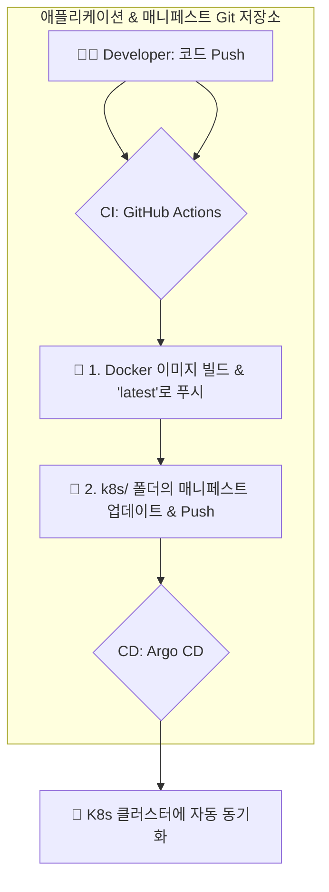

# 🚀 배포 및 모니터링 가이드

이 문서는 VLLM 평가 시스템의 벤치마크를 배포하고 모니터링하는 방법을 설명합니다. 여기서는 **Argo CD**를 활용한 GitOps 기반의 자동화된 배포 파이프라인을 구축하는 것을 권장합니다.

## GitOps 기반 배포 (Argo CD)

Argo CD를 사용하면 Kubernetes 매니페스트를 Git 저장소에서 관리하며, Git의 변경 사항이 클러스터에 자동으로 동기화되도록 할 수 있습니다. 이를 통해 배포 과정을 자동화하고, 모든 변경 사항을 추적하며, 안정적인 롤백을 보장할 수 있습니다.

### CI/CD 흐름

애플리케이션 코드와 Kubernetes 매니페스트가 동일한 Git 저장소에서 관리됩니다.



### 1단계: 클러스터에 Argo CD 설치 (Helm 사용)

먼저, 쿠버네티스 클러스터에 Argo CD를 설치합니다. Helm을 사용하면 간편하게 설치하고 관리할 수 있습니다.

```bash
# 1. Argo CD 네임스페이스 생성
kubectl create namespace argocd

# 2. Argo CD Helm 저장소 추가
helm repo add argo https://argoproj.github.io/argo-helm

# 3. Helm 차트를 사용하여 Argo CD 설치
helm install argocd argo/argo-cd --namespace argocd
```

설치가 완료된 후, 다음 명령어를 사용하여 초기 관리자 비밀번호를 확인하고 Argo CD UI에 접속할 수 있습니다.

```bash
# 초기 비밀번호 확인
kubectl -n argocd get secret argocd-initial-admin-secret -o jsonpath="{.data.password}" | base64 -d; echo

# Argo CD 서버에 포트 포워딩 (로컬에서 8080 포트로 접속)
kubectl port-forward svc/argocd-server -n argocd 8080:443
```
이제 웹 브라우저에서 `https://localhost:8080`으로 접속하여 사용자 이름 `admin`과 위에서 얻은 비밀번호로 로그인할 수 있습니다.

### 2단계: CI 파이프라인 설정 (GitHub Actions)

이 프로젝트의 CI/CD 파이프라인은 애플리케이션 코드와 Kubernetes 매니페스트를 **동일한 Git 저장소**에서 관리합니다. `.github/workflows/image-build.yml` 워크플로우는 벤치마크 관련 코드(예: `eval/` 디렉토리)가 변경되면 다음 작업을 자동으로 수행합니다.

1.  변경된 코드에 해당하는 Docker 이미지를 빌드하여 `:latest` 태그로 컨테이너 레지스트리(GHCR)에 푸시합니다.
2.  동일한 저장소 내의 `k8s/` 디렉토리에 있는 관련 Kubernetes 매니페스트 파일(예: `evalchemy-job.yaml`)을 수정합니다.
    - **`latest` 태그를 사용하므로 이미지 태그는 변경하지 않습니다.**
    - 대신, 매니페스트의 `annotations`에 현재 커밋 해시를 추가하여 Argo CD가 변경 사항을 감지하고 새로운 이미지를 배포하도록 합니다.
3.  수정된 매니페스트를 `[skip ci]` 메시지와 함께 다시 저장소에 푸시하여 무한 CI 루프를 방지합니다.

#### 필요한 설정
워크플로우가 저장소에 다시 푸시하려면 GitHub Actions의 기본 `GITHUB_TOKEN`에 쓰기 권한이 필요합니다. 저장소 `Settings > Actions > General`에서 `Workflow permissions`를 `Read and write permissions`으로 설정해야 합니다.

아래는 `image-build.yml` 워크플로우에서 매니페스트를 업데이트하는 부분의 예시입니다.

```yaml
# .github/workflows/image-build.yml
# ...
  - name: 🔄 Update K8s manifest to trigger Argo CD
    run: |
      # yq와 같은 도구를 사용하여 annotation 업데이트
      yq e '.spec.template.metadata.annotations."git-commit" = "${{ github.sha }}"' -i k8s/evalchemy-job.yaml
      
  - name: 🚀 Commit and push manifest changes
    run: |
      git config --global user.name 'github-actions'
      git config --global user.email 'github-actions@github.com'
      git add k8s/evalchemy-job.yaml
      git commit -m "Update evalchemy manifest for commit ${{ github.sha }} [skip ci]"
      git push
# ...
```

### 3단계: Argo CD Application 설정

Argo CD가 현재 Git 저장소의 `k8s/` 디렉토리를 모니터링하고 변경 사항을 클러스터에 동기화하도록 `Application` 리소스를 생성합니다.

```bash
# argocd-app.yaml 파일 생성
cat > argocd-app.yaml << 'EOF'
apiVersion: argoproj.io/v1alpha1
kind: Application
metadata:
  name: vllm-evalchemy-job
  namespace: argocd
spec:
  project: default
  source:
    # 현재 애플리케이션 Git 저장소 주소
    repoURL: 'https://github.com/your-org/your-repo.git' 
    targetRevision: HEAD
    # 매니페스트가 위치한 경로
    path: k8s 
  destination:
    server: 'https://kubernetes.default.svc'
    namespace: vllm-eval # 배포할 네임스페이스
  syncPolicy:
    automated:
      prune: true
      selfHeal: true
    syncOptions:
    - CreateNamespace=true
EOF

# 생성된 파일을 클러스터에 적용
kubectl apply -f argocd-app.yaml
```
또한, 매니페스트 파일(`k8s/evalchemy-job.yaml` 등)에서 `imagePullPolicy`를 `Always`로 설정해야 쿠버네티스가 항상 최신 버전의 `:latest` 이미지를 가져옵니다.

```yaml
# k8s/evalchemy-job.yaml
spec:
  template:
    spec:
      containers:
        - name: evalchemy
          image: your-registry/vllm-eval-evalchemy:latest
          imagePullPolicy: Always # <-- 이 부분을 확인/추가하세요.
```

이 방식을 통해 코드 푸시만으로 벤치마크 실행 및 업데이트가 완전히 자동화됩니다.

## 수동 배포 (로컬 테스트 및 개발용)

간단한 테스트나 개발 환경에서는 아래와 같이 수동으로 배포할 수 있습니다.

1.  **Docker 이미지 빌드 및 푸시**:
    ```bash
    docker build -t your-registry/vllm-eval-evalchemy:custom-task-v1 -f docker/evalchemy.Dockerfile .
    docker push your-registry/vllm-eval-evalchemy:custom-task-v1
    ```

2.  **`eval_config.json` 업데이트**: 이미지에 포함된 `eval/evalchemy/configs/eval_config.json` 파일에서 실행할 태스크를 활성화합니다. (수정 후 이미지 재빌드 필요)
    ```json
    {
      "custom_task_1": { "enabled": true },
      "custom_task_2": { "enabled": true }
    }
    ```

3.  **`k8s/evalchemy-job.yaml` 수정**: `image` 필드를 새로 빌드한 이미지 주소로 변경합니다.
    ```yaml
    # k8s/evalchemy-job.yaml
    spec:
      template:
        spec:
          containers:
            - name: evalchemy
              image: your-registry/vllm-eval-evalchemy:custom-task-v1
    ```

4.  **Kubernetes Job 실행**:
    ```bash
    kubectl apply -f k8s/evalchemy-job.yaml
    ```

## 모니터링 및 알림 설정

배포 방식과 관계없이, 벤치마크 결과는 Grafana와 Prometheus를 통해 모니터링하고 알림을 설정할 수 있습니다.

-   **Grafana 대시보드**: 새 벤치마크(`custom_task_1`)의 `exact_match` 점수를 시각화하는 패널 예시입니다.
    ```json
    // charts/grafana/dashboards/custom-benchmark.json
    {
      "title": "Custom Task 1 Score (exact_match)",
      "type": "stat",
      "targets": [{
        "expr": "avg(vllm_eval_exact_match{task='custom_task_1'}) by (model_tag)",
        "legendFormat": "{{model_tag}}"
      }]
    }
    ```

-   **Prometheus 알림 규칙**: `custom_task_1`의 점수가 전날 대비 10% 이상 하락하면 알림을 보냅니다.
    ```yaml
    # infra/monitoring/alert-rules.yaml
    - alert: CustomTaskRegression
      expr: |
        avg_over_time(vllm_eval_exact_match{task='custom_task_1'}[1h]) < 
        avg_over_time(vllm_eval_exact_match{task='custom_task_1'}[24h] offset 24h) * 0.9
      for: 10m
      annotations:
        summary: "Custom Task 1 성능 저하 감지"
    ``` 