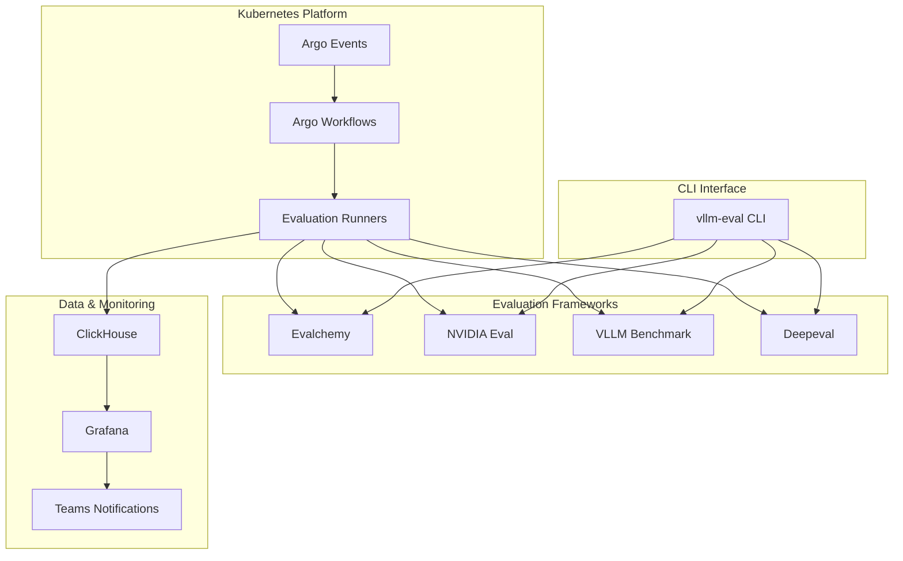

# VLLM Evaluation Benchmark

<div class="hero">
  <div class="hero-content">
    <h1>Automated Model Evaluation & Benchmarking</h1>
    <p class="hero-description">
      A comprehensive Kubernetes-based evaluation system for VLLM serving models.
      Continuous quality monitoring, performance benchmarking, and automated regression detection.
    </p>
    <div class="hero-buttons">
      <a href="user/getting-started/" class="btn btn-primary">Get Started</a>
      <a href="cli/overview/" class="btn btn-secondary">CLI Guide</a>
      <a href="https://github.com/thakicloud/vllm-eval-public" class="btn btn-outline">View on GitHub</a>
    </div>
  </div>
</div>

## Key Features

<div class="features-grid">
  
  <div class="feature-card">
    <div class="feature-icon">🚀</div>
    <h3>Multi-Framework Support</h3>
    <p>Unified interface for Evalchemy, NVIDIA Eval, VLLM Benchmark, and Deepeval frameworks</p>
  </div>
  
  <div class="feature-card">
    <div class="feature-icon">⚡</div>
    <h3>Performance Benchmarking</h3>
    <p>Comprehensive performance metrics: TTFT, TPOT, throughput analysis, and latency monitoring</p>
  </div>
  
  <div class="feature-card">
    <div class="feature-icon">🔄</div>
    <h3>Automated Workflows</h3>
    <p>Event-driven evaluation pipelines with Argo Workflows and Kubernetes orchestration</p>
  </div>
  
  <div class="feature-card">
    <div class="feature-icon">📊</div>
    <h3>Real-time Monitoring</h3>
    <p>Grafana dashboards, ClickHouse metrics storage, and Microsoft Teams notifications</p>
  </div>
  
  <div class="feature-card">
    <div class="feature-icon">🎯</div>
    <h3>Quality Assurance</h3>
    <p>Automated regression detection, quality metrics tracking, and continuous monitoring</p>
  </div>
  
  <div class="feature-card">
    <div class="feature-icon">⚙️</div>
    <h3>Flexible Configuration</h3>
    <p>TOML-based profiles, environment-specific settings, and customizable evaluation parameters</p>
  </div>
  
</div>

## Evaluation Frameworks

=== "Evalchemy"
    
    **Academic Benchmarks & Standard Evaluations**
    
    - MMLU (Massive Multitask Language Understanding)
    - HumanEval (Code Generation)
    - ARC (AI2 Reasoning Challenge)
    - HellaSwag (Commonsense Reasoning)
    
    ```bash
    vllm-eval run evalchemy my-model --endpoint http://localhost:8000/v1
    ```

=== "NVIDIA Eval"
    
    **Mathematical Reasoning & Coding**
    
    - AIME 2024 (Mathematical Problem Solving)
    - LiveCodeBench (Live Coding Challenges)
    - Advanced reasoning capabilities assessment
    
    ```bash
    vllm-eval run nvidia my-model --benchmark aime --gpus 2
    ```

=== "VLLM Benchmark"
    
    **Performance & Throughput Testing**
    
    - Time to First Token (TTFT)
    - Time Per Output Token (TPOT)
    - Concurrent request handling
    - Latency analysis
    
    ```bash
    vllm-eval run vllm-benchmark my-model --scenario performance
    ```

=== "Deepeval"
    
    **RAG & Custom Metrics**
    
    - Context relevance evaluation
    - Faithfulness assessment
    - Answer relevancy scoring
    - Custom metric development
    
    ```bash
    vllm-eval run deepeval my-model --suite rag
    ```

## Quick Start

### CLI Installation

```bash
# Clone the repository
git clone https://github.com/thakicloud/vllm-eval-public.git
cd vllm-eval-public

# Install CLI in development mode
pip install -e .

# Run setup wizard
vllm-eval setup

# Check system status
vllm-eval doctor
```

### First Evaluation

```bash
# Start your VLLM server
vllm serve my-model --port 8000

# Run Evalchemy evaluation
vllm-eval run evalchemy my-model --endpoint http://localhost:8000/v1

# View results
vllm-eval results list
```

### Kubernetes Deployment

```bash
# Deploy with Kind
make kind-deploy

# Install Helm charts
make helm-install

# Submit evaluation workflow
make submit-workflow
```

## Architecture Overview



## Use Cases

!!! example "Model Development"
    
    Run evaluations during model development to catch quality regressions early.
    
    ```bash
    vllm-eval run all my-dev-model --config development
    ```

!!! example "CI/CD Integration"
    
    Integrate with build pipelines for automated quality gates.
    
    ```bash
    vllm-eval run evalchemy $MODEL_NAME --config ci --batch-size 4
    ```

!!! example "Production Monitoring"
    
    Continuous monitoring of production models with alerts.
    
    ```bash
    # Kubernetes workflow triggered by GHCR image push
    # Automated evaluation → ClickHouse → Grafana → Teams
    ```

## Getting Started

<div class="getting-started-grid">
  
  <div class="start-card">
    <h3>📚 User Guide</h3>
    <p>Learn how to configure evaluations, interpret results, and manage benchmarks</p>
    <a href="user/getting-started/" class="card-link">Read User Guide →</a>
  </div>
  
  <div class="start-card">
    <h3>💻 Developer Guide</h3>
    <p>Set up development environment, contribute code, and extend functionality</p>
    <a href="developer/development-setup/" class="card-link">Developer Setup →</a>
  </div>
  
  <div class="start-card">
    <h3>🏗️ Architecture</h3>
    <p>Understand system design, components, and deployment architecture</p>
    <a href="architecture/system-overview/" class="card-link">System Overview →</a>
  </div>
  
  <div class="start-card">
    <h3>🔧 Operations</h3>
    <p>Deploy, monitor, troubleshoot, and scale the evaluation system</p>
    <a href="operations/monitoring-guide/" class="card-link">Operations Guide →</a>
  </div>
  
</div>

---

<div class="footer-cta">
  <h2>Ready to start evaluating your models?</h2>
  <p>Get up and running with VLLM Evaluation Benchmark in minutes</p>
  <a href="user/getting-started/" class="btn btn-primary btn-large">Get Started Now</a>
</div>

<style>
.hero {
  text-align: center;
  margin: 2rem 0 4rem 0;
  padding: 2rem;
}

.hero h1 {
  font-size: 3rem;
  font-weight: 700;
  margin-bottom: 1rem;
  background: linear-gradient(45deg, var(--md-primary-fg-color), var(--md-accent-fg-color));
  -webkit-background-clip: text;
  -webkit-text-fill-color: transparent;
  background-clip: text;
}

.hero-description {
  font-size: 1.25rem;
  margin-bottom: 2rem;
  max-width: 600px;
  margin-left: auto;
  margin-right: auto;
  line-height: 1.6;
}

.hero-buttons {
  display: flex;
  gap: 1rem;
  justify-content: center;
  flex-wrap: wrap;
}

.btn {
  display: inline-block;
  padding: 0.75rem 2rem;
  border-radius: 6px;
  text-decoration: none;
  font-weight: 600;
  transition: all 0.2s;
  border: 2px solid transparent;
}

.btn-primary {
  background: var(--md-primary-fg-color);
  color: var(--md-primary-bg-color) !important;
  border-color: var(--md-primary-fg-color);
}

.btn-primary:hover {
  background: var(--md-primary-fg-color--light);
  color: var(--md-primary-bg-color) !important;
}

.btn-secondary {
  background: var(--md-accent-fg-color);
  color: white !important;
  border-color: var(--md-accent-fg-color);
}

.btn-secondary:hover {
  background: var(--md-accent-fg-color--light);
  color: white !important;
}

.btn-outline {
  background: transparent;
  border: 2px solid var(--md-primary-fg-color);
  color: var(--md-primary-fg-color) !important;
}

.btn-outline:hover {
  background: var(--md-primary-fg-color);
  color: var(--md-primary-bg-color) !important;
}

.btn-large {
  font-size: 1.1rem;
  padding: 1rem 2.5rem;
}

.btn:hover {
  transform: translateY(-2px);
  box-shadow: 0 4px 12px rgba(0,0,0,0.15);
}

.features-grid {
  display: grid;
  grid-template-columns: repeat(auto-fit, minmax(300px, 1fr));
  gap: 2rem;
  margin: 3rem 0;
}

.feature-card {
  padding: 2rem;
  border-radius: 8px;
  border: 1px solid var(--md-default-fg-color--lightest);
  text-align: center;
  transition: transform 0.2s, box-shadow 0.2s;
}

.feature-card:hover {
  transform: translateY(-4px);
  box-shadow: 0 8px 25px rgba(0,0,0,0.1);
}

.feature-icon {
  font-size: 3rem;
  margin-bottom: 1rem;
}

.feature-card h3 {
  margin: 1rem 0 0.5rem 0;
  color: var(--md-primary-fg-color);
}

.getting-started-grid {
  display: grid;
  grid-template-columns: repeat(auto-fit, minmax(250px, 1fr));
  gap: 1.5rem;
  margin: 2rem 0;
}

.start-card {
  padding: 1.5rem;
  border-radius: 8px;
  border: 1px solid var(--md-default-fg-color--lightest);
  transition: transform 0.2s;
}

.start-card:hover {
  transform: translateY(-2px);
}

.start-card h3 {
  margin-top: 0;
  color: var(--md-primary-fg-color);
}

.card-link {
  color: var(--md-primary-fg-color) !important;
  text-decoration: none;
  font-weight: 600;
  display: inline-block;
  margin-top: 0.5rem;
  transition: all 0.2s;
}

.card-link:hover {
  color: var(--md-accent-fg-color) !important;
  text-decoration: underline;
}

.footer-cta {
  text-align: center;
  margin: 4rem 0 2rem 0;
  padding: 3rem 2rem;
  background: var(--md-code-bg-color);
  border-radius: 12px;
  border: 1px solid var(--md-default-fg-color--lightest);
}

.footer-cta h2 {
  margin-bottom: 1rem;
  color: var(--md-default-fg-color);
}

.footer-cta p {
  color: var(--md-default-fg-color--light);
  margin-bottom: 2rem;
}

@media (max-width: 768px) {
  .hero h1 {
    font-size: 2rem;
  }
  
  .hero-buttons {
    flex-direction: column;
    align-items: center;
  }
  
  .features-grid {
    grid-template-columns: 1fr;
  }
}

/* Dark theme improvements */
[data-md-color-scheme="slate"] .btn-primary {
  background: var(--md-primary-fg-color);
  color: var(--md-primary-bg-color) !important;
}

[data-md-color-scheme="slate"] .btn-secondary {
  background: var(--md-accent-fg-color);
  color: var(--md-default-bg-color) !important;
}

[data-md-color-scheme="slate"] .btn-outline {
  border-color: var(--md-primary-fg-color);
  color: var(--md-primary-fg-color) !important;
}

[data-md-color-scheme="slate"] .btn-outline:hover {
  background: var(--md-primary-fg-color);
  color: var(--md-default-bg-color) !important;
}

/* Light theme improvements */
[data-md-color-scheme="default"] .btn-primary {
  background: var(--md-primary-fg-color);
  color: white !important;
}

[data-md-color-scheme="default"] .btn-secondary {
  background: var(--md-accent-fg-color);
  color: white !important;
}

[data-md-color-scheme="default"] .btn-outline {
  border-color: var(--md-primary-fg-color);
  color: var(--md-primary-fg-color) !important;
}

[data-md-color-scheme="default"] .btn-outline:hover {
  background: var(--md-primary-fg-color);
  color: white !important;
}
</style>
